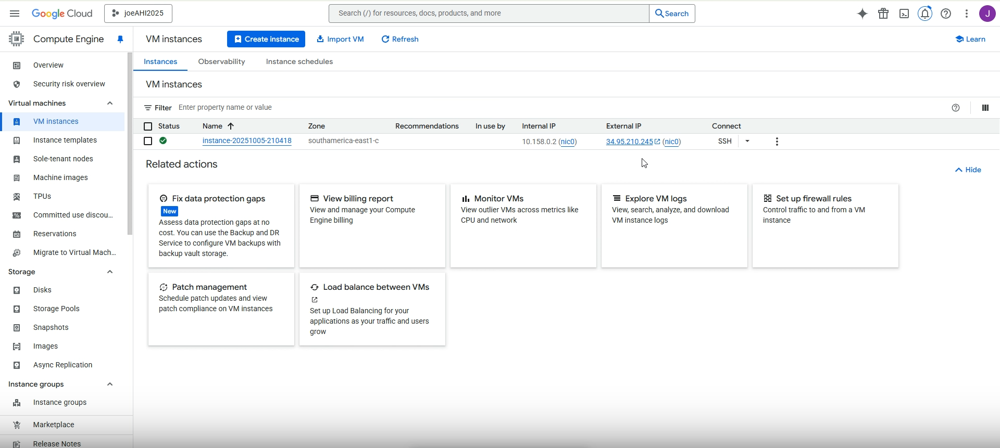
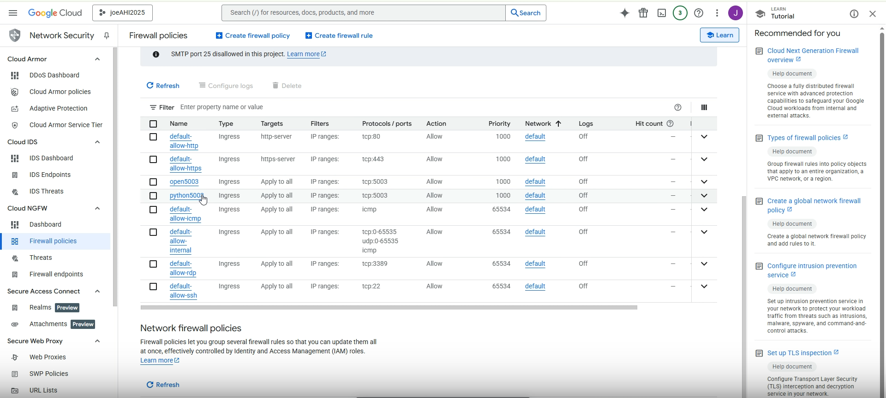
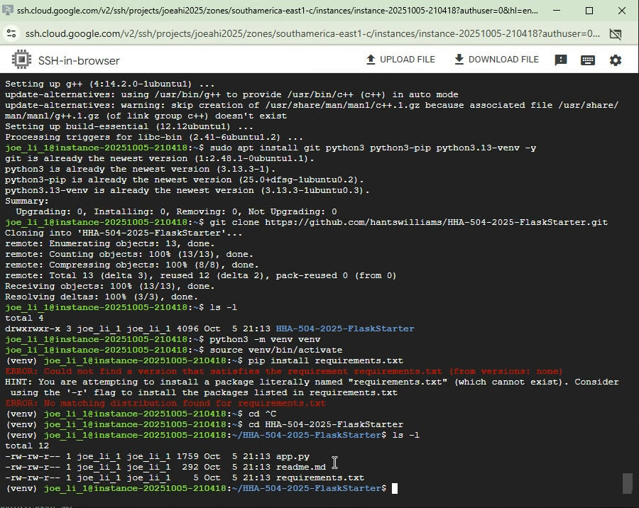
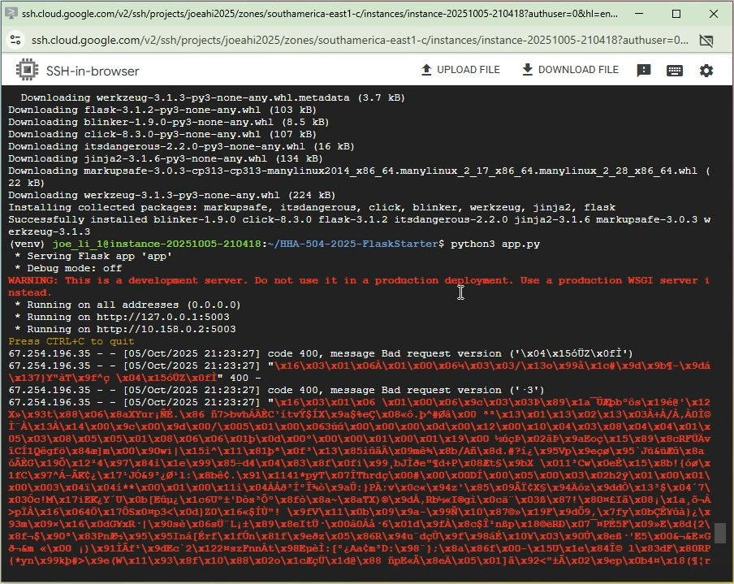

# cloud_vm_networking_flask
Flask on Cloud VM

# AHI 504 — Cloud Foundations for Health Informatics  
## Lab: Deploy a Flask App on a Cloud VM  

**Purpose.** Learn how to configure and expose, via networking configurations, a simple web application on a cloud-hosted virtual machine (VM). You will (1) choose a cloud provider, (2) create and configure a VM with an open port, (3) install and run a Flask app, and (4) make the app accessible on the internet.  

**What you’ll gain.** Hands-on practice with networking (firewall rules, ports), package installation (Python), application hosting, and optional domain name setup. This builds on the VM lifecycle skills from Assignment 1.

### Images
1. Created a VM

2. Networking Port 5003 Open

2. Flask is installed

3. Flask is running / Error code 400

### Videos

(Videos was split up due to Loom only allowing 5min max per video)

Part 1. [Setting up VM](https://www.loom.com/share/71909e7d5ac94c929d0c92056039dcc2?sid=4ccfe613-e3a2-45be-aadf-5a5389f64c19)

Part 2. [Environment Configuration](https://www.loom.com/share/b7348c75450a47829667c2f4c3590a35?sid=247d7d09-ddc0-4b81-b63f-011383cfd94f)

Part 3. [Installing requirement and running the code](https://www.loom.com/share/a9509443c8c44b86a0c411f376828c6f?sid=fa9afcea-7329-44ac-852f-179752aacad2)

Part 4. [Error 400 and checking Fire Wall rules](https://www.loom.com/share/37c92e0613154103af0008d01110278b?sid=935246ce-493f-4db6-b70e-f8af0e44ba60)

### Notes:

Followed the step but am unsure what went wrong. Suspect it has to do with my fire wall rule but watched zoom replay and am pretty sure I followed the step exactly. Might have missed something, please watch the video and point out my mistake. Thank you!

P.S.

Or did I used the incorrect IP address? but does it matter since I allow all IP address I thought.